##### 建表：
create table test(
id int primary key auto_increment,
name varchar(20),
sex char(3),
age int,
address varchar(50));

insert into test(name,sex,age,address) values
("张三","女",19,"北京"),
("李四","男",20,"上海"),
("王五","女",25,"广州")
("薛六","女",20,"北京"),
("王五","男",22,"北京"),
("赵七","男",28,"上海"),
("张四","女",23,"北京");

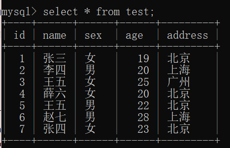

##### （1）. 写出sql语句，查询所有年龄大于20岁的员工

select * from test where age > 20;

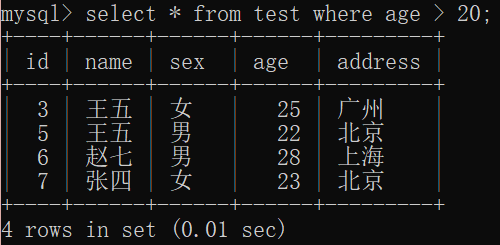

##### （2）. 写出sql语句，查询所有年龄大于等于22小于25的女性员工

select * from test where age >= 22 and age < 25 and sex = '女';

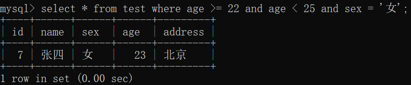

##### （3）. 写出sql语句，统计男女员工各有多少名

select sex, count(*) from test group by sex;

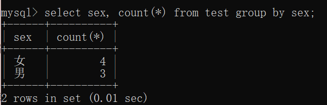

##### （4）. 写出sql语句，按照年龄降序获取员工信息

select * from test order by age desc;

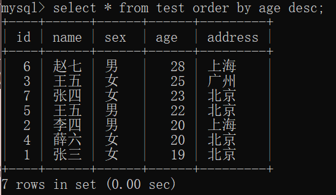

##### （5）. 写出sql语句，获取员工中哪个姓名具有重名现象

select name, count(*) from test group by name having count(*) > 1;

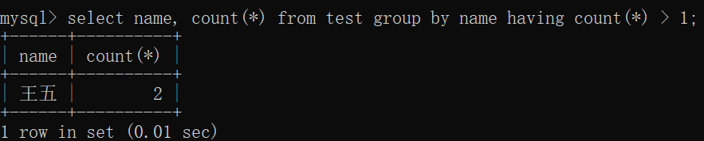

##### （6）. 写出sql语句，查询所有姓张的员工

select * from test where name like '张%';

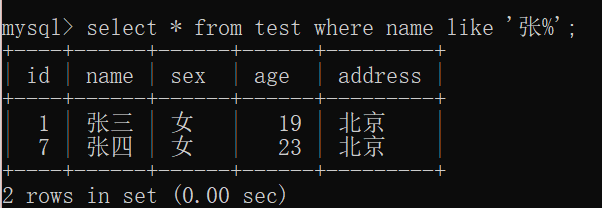

##### （7）. 写出sql语句，查询住址为北京的前3条记录

select * from test where address = '北京' limit 3;

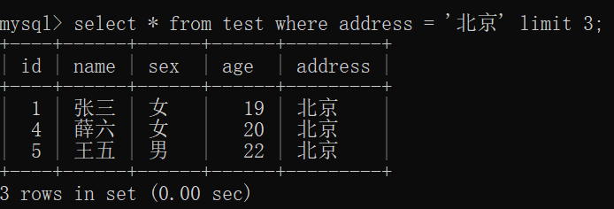

##### （8）. 写出sql语句，查询员工总数

select count(*) from test;

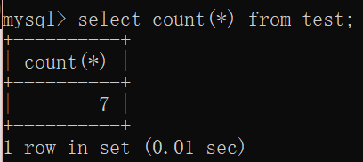

##### （9）. 写出sql语句，向表中插入一条记录

insert into test (name, sex, age, address) values ('张三', '男', 25, '上海');

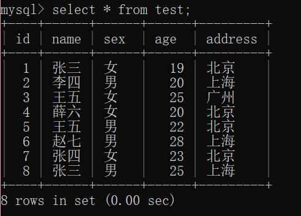

##### （10）.写出sql语句，修改员工张四的住址为南京

update test set address = '南京' where name = '张四';

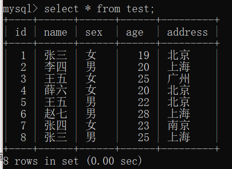

##### （11）.写出sql语句，删除年龄大于24岁的女员工

delete from test where age > 24 and sex = '女';

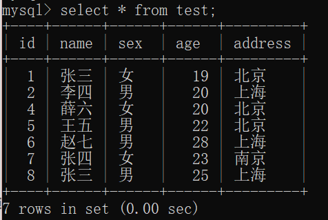
